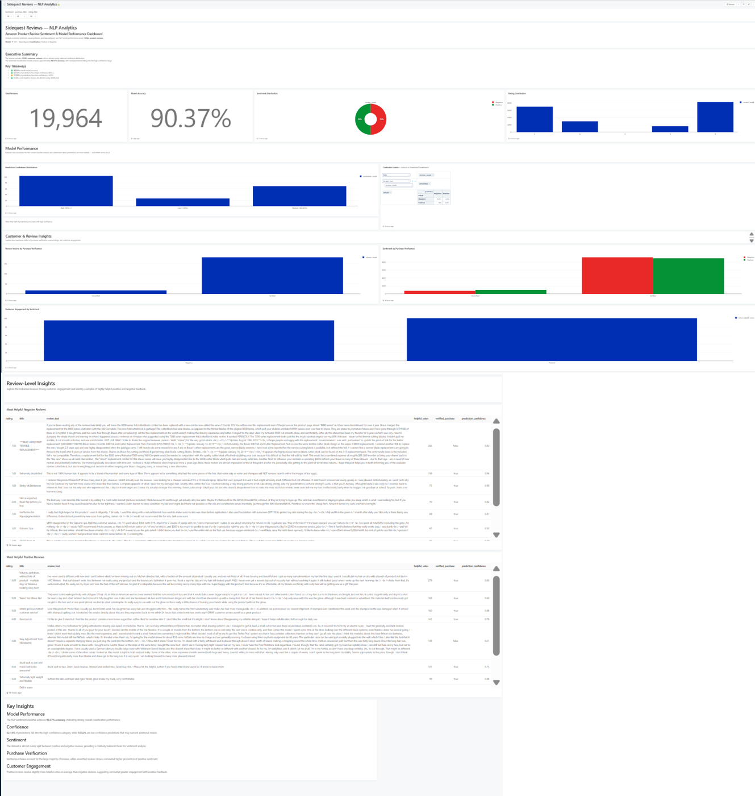
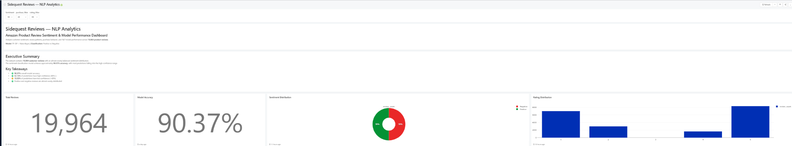
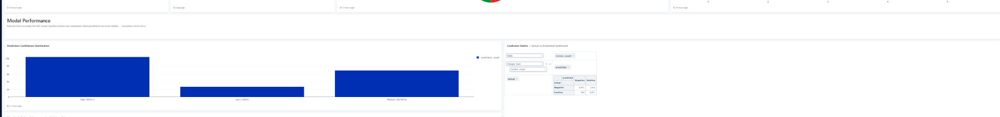
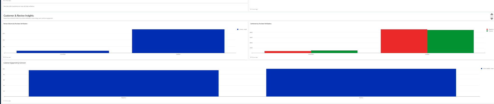
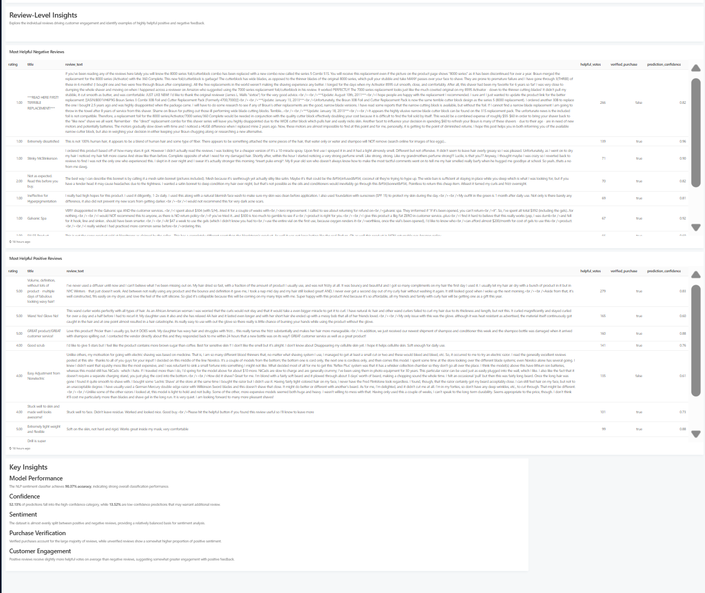
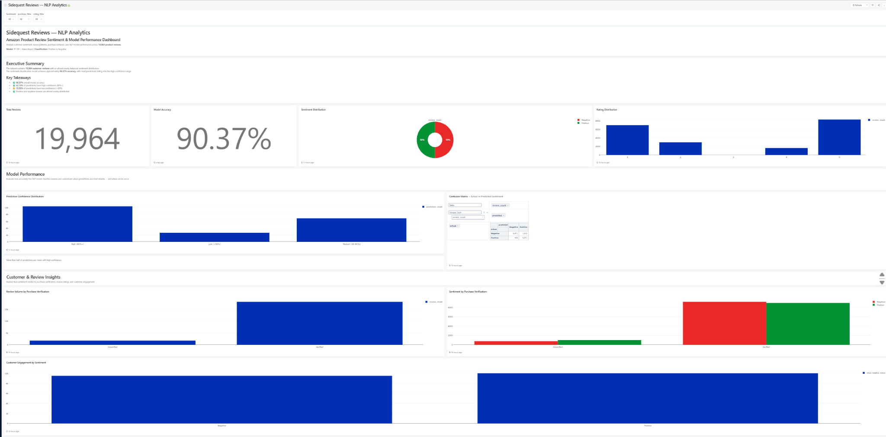

<h1 align="center">
SideQuest Reviews
</h1>

<p align="center">
Turning customer reviews into meaningful insights using NLP, SQL, and interactive analytics.
</p>

<p align="center">
<i>From raw reviews to sentiment classification, model evaluation, and decision-oriented customer insights.</i>
</p>

<br>

<p align="center">


</p>

---

## About the Project

**SideQuest Reviews** is an end-to-end NLP and analytics project built using Amazon product reviews.

The project explores how customer feedback can be transformed from raw text into structured insights through a combination of:

**Data Preparation → NLP → Sentiment Classification → PostgreSQL → SQL Analytics → Redash**

Rather than stopping at sentiment prediction, the project focuses on the bigger analytical picture:

* What is the overall customer sentiment?
* How do ratings relate to sentiment?
* Does purchase verification influence sentiment?
* How confident is the NLP model?
* Which reviews receive the most engagement?
* What can individual customer reviews tell us?

The result is an interactive dashboard that brings **model performance and customer insights together in one place.**

---

## 📊 Project at a Glance

| Metric                 | Result                   |
| ---------------------- | ------------------------ |
| 📝 Reviews Analyzed    | **19,964**               |
| 🎯 Model Accuracy      | **90.37%**               |
| 🧠 Classification      | **Positive vs Negative** |
| 🔤 Text Representation | **TF-IDF**               |
| 🤖 Classifier          | **Naive Bayes**          |
| 🗄️ Database           | **PostgreSQL**           |
| 📊 Dashboard           | **Redash**               |

---

## 🎯 What I Built

### 1. Data Preparation

Started with a large Amazon product review dataset and built a preprocessing pipeline to create a clean, analysis-ready dataset.

The preparation stage includes:

* Selecting relevant review fields
* Handling missing values
* Cleaning review text
* Preparing sentiment labels
* Creating a balanced working dataset
* Generating the final dataset used by the NLP pipeline

---

### 2. NLP & Sentiment Classification

The review text is processed using traditional NLP techniques before being passed into a machine learning classifier.

### Text Processing

```text
Raw Review
     ↓
Text Cleaning
     ↓
Tokenization
     ↓
Stop-word Removal
     ↓
TF-IDF Vectorization
```

### Classification

```text
TF-IDF Features
       ↓
Naive Bayes Classifier
       ↓
Predicted Sentiment
       ↓
Prediction Confidence
```

The model classifies each review as:

```text
Positive
Negative
```

Prediction confidence is also retained so that model outputs can be analyzed beyond simple accuracy.

---

## 📈 Model Performance

The final sentiment classifier achieved:

<h2 align="center">
90.37% Accuracy
</h2>

The dashboard also examines prediction confidence:

* **52.13%** of predictions fall into the high-confidence category
* **13.52%** fall into the low-confidence category
* The remaining predictions fall into the medium-confidence category

This provides a more useful view of model performance than accuracy alone.

Instead of simply asking:

> "How accurate is the model?"

the analysis also asks:

> "How confident is the model in the predictions it makes?"

---

## 📊 Redash Dashboard

The final analytics layer is built in **Redash**, where SQL queries are transformed into an interactive dashboard.

The dashboard is organized into four major sections.

<p align="center">

<a href="assets/dashboard-full.png">

</a>

</p>

<p align="center">
<i>Click the dashboard to view the full-resolution version.</i>
</p>

### Executive Summary



* Total Reviews
* Model Accuracy
* Sentiment Distribution
* Rating Distribution

### Model Performance




* Prediction Confidence Distribution
* Confusion Matrix
* Actual vs Predicted Sentiment

### Customer & Review Insights




* Review Volume by Purchase Verification
* Sentiment by Purchase Verification
* Helpful Votes by Sentiment

### Review-Level Insights

* Most Helpful Negative Reviews
* Most Helpful Positive Reviews
* Key Decision-Oriented Insights



---

## 🔎 Interactive Dashboard Filters

The dashboard can be explored using three filters:

**Sentiment**

```text
All
Positive
Negative
```

**Purchase Verification**

```text
All
Verified
Unverified
```

**Rating**

```text
All
1
2
3
4
5
```

These filters allow the user to move from a high-level overview to more specific customer segments.

---

## 🖥️ Dashboard Preview

<p align="center">

</p>

<p align="center">
<i>Interactive Redash dashboard for sentiment, model performance, and customer review analysis.</i>
</p>

---

## 💡 Key Insights

The purpose of the dashboard is not just to display charts, but to make the analysis more **decision-oriented**.

### 😊 Sentiment

The dataset contains a relatively balanced distribution of positive and negative reviews, providing a useful foundation for binary sentiment analysis.

### ⭐ Ratings

Rating distribution provides additional context for sentiment patterns and allows users to examine how customer sentiment changes across rating levels.

### 🛒 Purchase Verification

Verified purchases represent the majority of reviews, allowing sentiment and review volume to be compared between verified and unverified customers.

### 👍 Customer Engagement

Helpful votes provide a useful indicator of which customer reviews receive greater engagement.

The dashboard allows these engagement patterns to be explored by sentiment.

### 🔍 Review-Level Insights

Aggregate metrics tell us **what is happening**.

The most helpful positive and negative reviews help explore **why it may be happening**.

This creates a path from:

**Metric → Pattern → Customer Feedback → Insight**

---

## 🗄️ SQL Analytics

The SQL layer powers the analytical side of the project.

Queries were created for:

* Total review volume
* Sentiment distribution
* Rating distribution
* Prediction confidence
* Confusion matrix
* Purchase verification
* Sentiment by purchase verification
* Helpful votes by sentiment
* Most helpful negative reviews
* Most helpful positive reviews

The queries are stored in:

```text
sql/
├── schema.sql
└── analytics.sql
```

---

## 🏗️ Project Structure

```text
sidequest-reviews/
│
├── assets/
│   └── dashboard.png
│
├── data/
│   ├── raw/                    # Raw dataset - not committed
│   └── processed/              # Processed datasets - not committed
│
├── notebooks/                  # Exploratory analysis
│
├── sql/
│   ├── analytics.sql           # Dashboard & analytical queries
│   └── schema.sql              # PostgreSQL database schema
│
├── src/
│   ├── prepare_dataset.py      # Dataset preparation
│   ├── nlp_model.py            # NLP & sentiment classification
│   └── load_database.py        # PostgreSQL data loading
│
├── .gitignore
├── README.md
└── requirements.txt
```

---

## 🛠️ Tech Stack

### Programming

`Python` · `SQL`

### Data & NLP

`Pandas` · `NumPy` · `NLTK` · `Scikit-learn`

### Machine Learning

`TF-IDF` · `Naive Bayes`

### Database

`PostgreSQL`

### Analytics & Visualization

`Redash`

### Development

`Jupyter Notebook` · `VS Code` · `Git` · `GitHub`

---

## 🔄 End-to-End Architecture

```text
                 Amazon Product Reviews
                           │
                           ▼
                ┌─────────────────────┐
                │   Data Preparation  │
                │      Pandas         │
                └──────────┬──────────┘
                           │
                           ▼
                ┌─────────────────────┐
                │   NLP Preprocessing │
                │       NLTK          │
                └──────────┬──────────┘
                           │
                           ▼
                ┌─────────────────────┐
                │   TF-IDF Features   │
                └──────────┬──────────┘
                           │
                           ▼
                ┌─────────────────────┐
                │   Naive Bayes Model │
                └──────────┬──────────┘
                           │
                ┌──────────┴──────────┐
                ▼                     ▼
        Predicted Sentiment    Prediction Confidence
                │                     │
                └──────────┬──────────┘
                           ▼
                ┌─────────────────────┐
                │     PostgreSQL      │
                └──────────┬──────────┘
                           │
                           ▼
                ┌─────────────────────┐
                │    SQL Analytics    │
                └──────────┬──────────┘
                           │
                           ▼
                ┌─────────────────────┐
                │   Redash Dashboard  │
                └─────────────────────┘
```

---

## 🚀 Getting Started

### Clone the Repository

```bash
git clone https://github.com/aamina-codes/sidequest-reviews.git

cd sidequest-reviews
```

### Create a Virtual Environment

```bash
python -m venv venv
```

For Windows PowerShell:

```powershell
venv\Scripts\activate
```

### Install Dependencies

```bash
pip install -r requirements.txt
```

### Prepare the Dataset

Place the source dataset inside:

```text
data/raw/
```

Then run:

```bash
python src/prepare_dataset.py
```

### Run the NLP Pipeline

```bash
python src/nlp_model.py
```

### Configure PostgreSQL

The database password is handled through an environment variable and is **not stored in the repository**.

For PowerShell:

```powershell
$env:SIDEQUEST_DB_PASSWORD="your_password"
```

Then run:

```bash
python src/load_database.py
```

### Run the SQL Layer

Use:

```text
sql/schema.sql
```

to create the database structure.

Then use:

```text
sql/analytics.sql
```

for the analytical queries used by the Redash dashboard.

---

## 🔐 Data & Security

The raw and processed datasets are intentionally excluded from GitHub because of their size.

The repository contains the **code, SQL, and documentation required to reproduce the project** without committing large data files.

Sensitive credentials are handled through environment variables and excluded using `.gitignore`.

---

## 👩‍💻 About the Project

SideQuest Reviews was built as an exploration of how **NLP, data analytics, SQL, and visualization can work together to turn unstructured customer feedback into useful information.**

The project helped me work across the complete analytics pipeline:

```text
Data
 ↓
Python
 ↓
NLP
 ↓
Machine Learning
 ↓
SQL
 ↓
PostgreSQL
 ↓
Redash
 ↓
Decision-Oriented Insights
```

The focus throughout the project was not simply on building a model, but on creating an analytical workflow where **model outputs can actually be explored and interpreted.**

---


<p align="center">
<b>Aamina Shaik</b>
</p>

<p align="center">
Data Science · Data Analytics · NLP · Machine Learning
</p>

<p align="center">

<a href="https://github.com/aamina-codes">

</a>

<a href="https://www.linkedin.com/in/aaminashaik8/">

</a>

</p>
